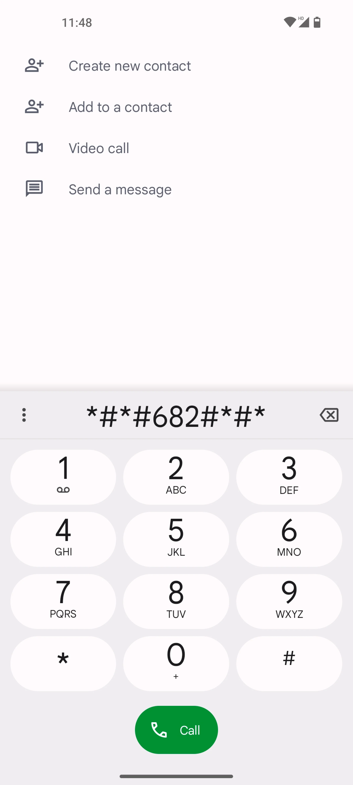
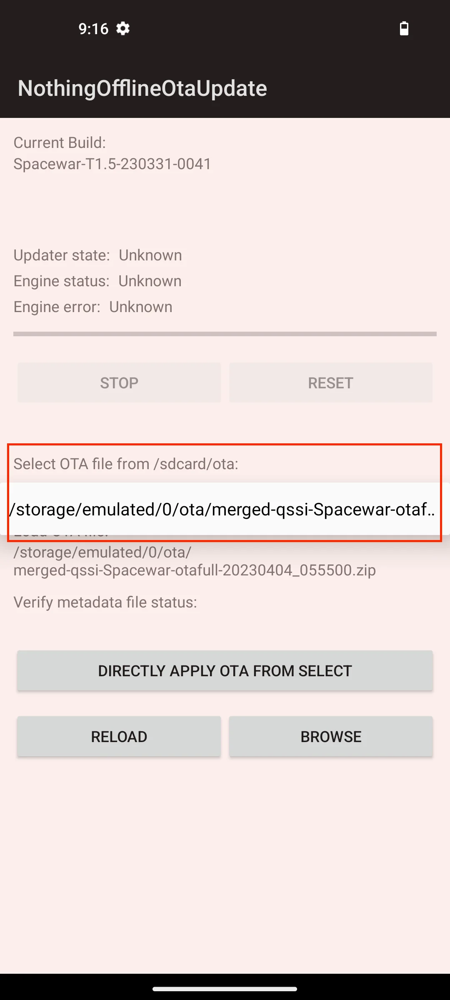
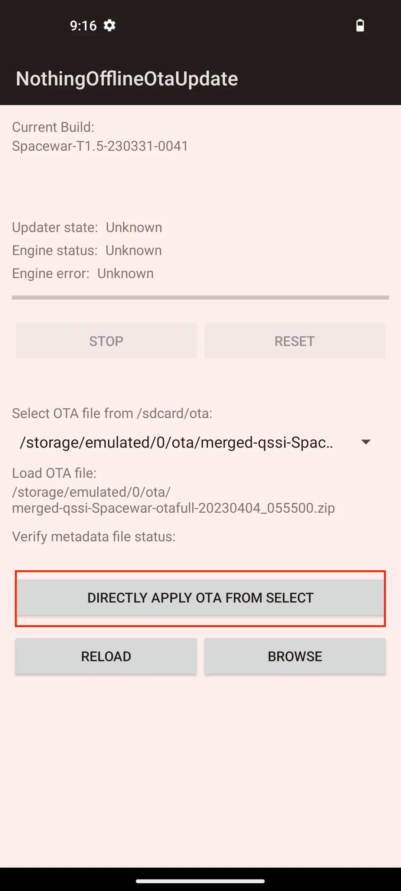
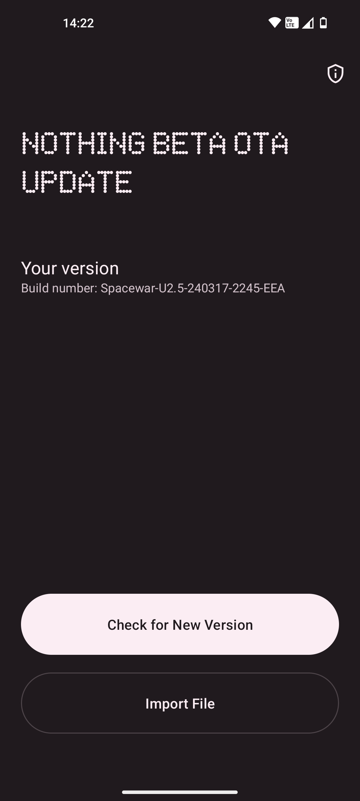
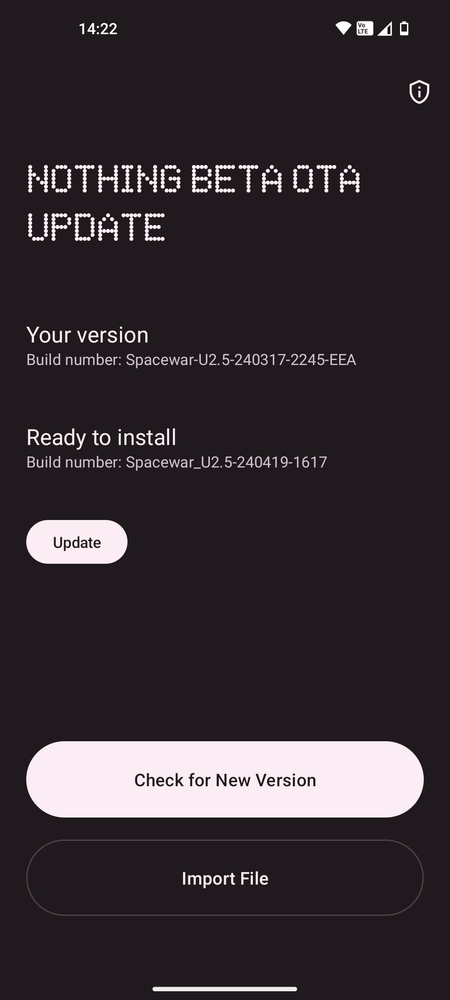

# Nothing Archive
This repository contains firmware files for Nothing Phone 1, 2, 2a and CMF Phone 1. And also boot and fastboot files. The firmware files are sourced from the official OTA servers and are mirrored here for archival purposes. The files themself are stored on archive.org. Boot and fastboot files are sourced from reindex-ot.github.io.

Here is a list of all the firmware files available for download:

| Product | OTA | BOOT | Fastboot | Torrent |
|---------|-----|------|----------|---------|
| Nothing Phone 1 | ✅ | ✅ | ✅ | [torrent](https://archive.org/download/nothing-phone-1-firmware/nothing-phone-1-firmware_archive.torrent) |
| Nothing Phone 2 | ✅ | ✅ | ✅ | [torrent](https://archive.org/download/nothing-phone-2-firmware/nothing-phone-2-firmware_archive.torrent) |
| Nothing Phone 2a | ✅ | ✅ | ✅ | [torrent](https://archive.org/download/nothing-phone-2a-firmware/nothing-phone-2a-firmware_archive.torrent) |
| CMF Phone 1 | ✅ | ❌ | ❌ | [torrent](https://archive.org/download/cmf-phone-1-firmware/cmf-phone-1-firmware_archive.torrent) |

## Table of Contents
-   [Nothing Phone 1](#nothing-phone-1)
    -   [Android 14](#android-14)
    -   [Android 14 Developer Preview](#android-14-developer-preview)
    -   [Android 13](#android-13)
    -   [Android 12](#android-12)
    -   [Boot Firmware](#boot-firmware)
    -   [Fastboot Firmware](#fastboot-firmware)
-   [Nothing Phone 2](#nothing-phone-2)
    -   [Android 15 Developer Preview](#android-15-developer-preview)
    -   [Android 14](#android-14-1)
    -   [Android 13](#android-13-1)
    -   [Boot Firmware](#boot-firmware-1)
    -   [Fastboot Firmware](#fastboot-firmware-1)
-   [Nothing Phone 2a](#nothing-phone-2a)
    -   [Android 15 Developer Preview](#android-15-developer-preview-1)
    -   [Android 14](#android-14-2)
    -   [Boot Firmware](#boot-firmware-2)
    -   [Fastboot Firmware](#fastboot-firmware-2)
-   [CMF Phone 1](#cmf-phone-1)
    -   [Android 14](#android-14-3)
-   [Kernel and device tree sources](#kernel-and-device-tree-sources)
-   [Glyph Developer Kit](#glyph-developer-kit)
-   [Nothing Offline Ota Update Tool](#nothing-offline-ota-update-tool)
-   [Sideload Firmware](#sideload-firmware)
-  [Credits](#credits)
-  [License](#license)

## Nothing Phone 1

### Android 14

|Version|build number|Full OTA|Incremental OTA|Rollback|
|-------|------------|--------|---------------|--------|
|2.5.6|Spacewar-U2.5-240612-2149|[EEA/GLOBAL](https://archive.org/download/nothing-phone-1-firmware/2.5.6/merged-qssi-Spacewar-otafull-20240612_214905.zip)|[EEA/GLOBAL from 2.5.5](https://archive.org/download/nothing-phone-1-firmware/2.5.6/54c1298c0fbeae5b9f2454762183beb074d883b5.zip)||
|2.5.5|Spacewar-U2.5-240419-1617||[EEA/GLOBAL from 2.5.3A](https://archive.org/download/nothing-phone-1-firmware/2.5.5/1b6de06002f9cbb4e62a1ec4267e72910e705c78.zip) [EEA/GLOBAL from 2.5.2 hotfix](https://archive.org/download/nothing-phone-1-firmware/2.5.5/d464235c4b9920d93d662b21e9713632731a203a.zip)||
|2.5.3A|Spacewar-U2.5-240317-2245|[EEA/GLOBAL](https://archive.org/download/nothing-phone-1-firmware/2.5.3A/af8523121e2e73f564bb78ceb3074deec7222c6b.zip)|[EEA/GLOBAL from 2.5.3](https://archive.org/download/nothing-phone-1-firmware/2.5.3A/176fffc72ad05488556821215d3e10ffc939ff35.zip) [EEA/GLOBAL from 2.5.2 hotfix](https://archive.org/download/nothing-phone-1-firmware/2.5.3A/158f65d4c44323ac9ea4c0c64e97b0a37d9aac74.zip)||
|2.5.3|Spacewar-U2.5-240301-1852||[EEA/GLOBAL from 2.5.2 hotfix](https://archive.org/download/nothing-phone-1-firmware/2.5.3/993ef2c61a5d996015d7ff07f955cc8dbb6344c4.zip)||
|2.5.2 hotfix|Spacewar-U2.5-240207-1031|[EEA/GLOBAL](https://archive.org/download/nothing-phone-1-firmware/2.5.2%20hotfix/80dec3051c16eb22f456e8682917f0849b749ba8.zip)|[EEA/GLOBAL from 2.5.2](https://archive.org/download/nothing-phone-1-firmware/2.5.2%20hotfix/8360e08fd1591985d36398a2e0549a93bae0d191.zip) [EEA/GLOBAL from 2.0.5](https://archive.org/download/nothing-phone-1-firmware/2.5.2%20hotfix/11d4669cdf0b425d4f8e237f71edc849062365da.zip)||
|2.5.2|Spacewar-U2.5-240119-1910||[EEA/GLOBAL from 2.5.1 open beta 2](https://archive.org/download/nothing-phone-1-firmware/2.5.2/6dfc76a6c3f009d12c2f81955e4424e93f6293ec.zip) [EEA/GLOBAL from 2.0.5](https://archive.org/download/nothing-phone-1-firmware/2.5.2/af7de84da8337982201cbd7da8cee51ddc9d0241.zip)||
|2.5.1 open beta 2|Spacewar-U2.5-240106-2238||[EEA/GLOBAL from 2.5.1 closed beta 1 hotfix 2](https://archive.org/download/nothing-phone-1-firmware/2.5.1/open%20beta2/238c2558175aca6ae8423b86e9753bb1c21b547c.zip) [EEA/GLOBAL from 2.5.1 open beta 1](https://archive.org/download/nothing-phone-1-firmware/2.5.1/open%20beta2/893848a68e13391107fd0790a6b95719146900ff.zip)|[EEA/GLOBAL to 2.0.5](https://archive.org/download/nothing-phone-1-firmware/2.5.1/open%20beta2/ota_diff_20240106_223823_20231110_173157.zip)|
|2.5.1 closed beta 1 hotfix 2|Spacewar-U2.5-231005-0836||[GLOBAL/EEA incremental from 2.5.1 closed beta 1 hotfix](https://archive.org/download/nothing-phone-1-firmware/2.5.1/open%20beta1/946762fa268bb0898509de8578814741542c5311.zip)||
|2.5.1 open beta 1|Spacewar-U2.5-231215-2256||[GLOBAL/EEA from 2.0.5](https://archive.org/download/nothing-phone-1-firmware/2.5.1/open%20beta1/ota_diff_20231110_173157_20231215_225600.zip)|[GLOBAL/EEA to 2.0.5](https://archive.org/download/nothing-phone-1-firmware/2.5.1/open%20beta1/ota_diff_20231215_225600_20231110_173157.zip)|
|2.5.1 closed beta 1 hotfix|Spacewar-U2.5-231005-1147||[GLOBAL/EEA from 2.5.1 closed beta 1](https://archive.org/download/nothing-phone-1-firmware/2.5.1/closed%20beta1%20hotfix/36fe7c14ca535ec865d63c28ca7973798e43efda.zip)||
|2.5.1 closed beta 1|Spacewar-U2.5-231005-0153||[GLOBAL/EEA from 2.0.5](https://archive.org/download/nothing-phone-1-firmware/2.5.1/closed%20beta1/288576a3468f6c6adaf40f749c408f6a63e1b1c1.zip)||

### Android 14 Developer Preview

|Version|build number|Incremental OTA|Rollback|
|-------|------------|---------------|--------|
|ADP 14 BETA 3|UpsideDownCake-230719-1535|[GLOBAL/EEA from 1.5.6](https://archive.org/download/nothing-phone-1-firmware/Android%2014%20Developer%20Preview/BETA3/ota_diff_20230706_194202_20230719_153500.zip)|[GLOBAL/EEA to 1.5.6](https://archive.org/download/nothing-phone-1-firmware/Android%2014%20Developer%20Preview/BETA3/ota_diff_20230719_153500_20230706_194202.zip)|
|ADP 14 BETA 1|UpsideDownCake-230321-2229|[GLOBAL/EEA from 1.5.4](https://archive.org/download/nothing-phone-1-firmware/Android%2014%20Developer%20Preview/BETA1/ota_diff_20230428_201717_20230428_222944.zip)|[GLOBAL/EEA to 1.5.4](https://archive.org/download/nothing-phone-1-firmware/Android%2014%20Developer%20Preview/BETA1/ota_diff_20230428_222944_20230428_201717.zip)|

### Android 13

|Version|build number|Full OTA|Incremental OTA|
|-------|------------|--------|---------------|
|2.0.5|Spacewar-T2.0-231110-1731|[GLOBAL/EEA](https://archive.org/download/nothing-phone-1-firmware/2.0.5/d8c21c8c162c9677ba78e51305abaf5b0ccd30e2.zip)|[GLOBAL/EEA from 2.0.4](https://archive.org/download/nothing-phone-1-firmware/2.0.5/d7a07c6103f9aa3cfc93a83d8d15d547f6281b67.zip) [GLOBAL/EEA from 1.5.6](https://archive.org/download/nothing-phone-1-firmware/2.0.5/af30545337f5e2c40600fe6eb237033467456be7.zip) [GLOBAL/EEA from 1.5.4](https://archive.org/download/nothing-phone-1-firmware/2.0.5/6a42790767b4b1091ba52d1a675df21f68df7d1b.zip)|
|2.0.4|Spacewar-T2.0-231006-1014||[GLOBAL/EEA from 2.0.2 hotfix](https://archive.org/download/nothing-phone-1-firmware/2.0.4/c7d1f41953dcf87dd7201ac4c11906bf0e8e3858.zip)|
|2.0.2 hotfix|Spacewar-T2.0-230901-1652|[GLOBAL/EEA](https://archive.org/download/nothing-phone-1-firmware/2.0.2%20hotfix/6da1e9319f3aa4443175dd1d4d9a10cdbbac6dbe.zip)|[GLOBAL/EEA from 2.0.2](https://archive.org/download/nothing-phone-1-firmware/2.0.2%20hotfix/1adc1351b0bd9a7a75efe40b3aa8baa7c6eb054f.zip) [GLOBAL/EEA from 1.5.6](https://archive.org/download/nothing-phone-1-firmware/2.0.2%20hotfix/90c0ffe26ea5149fef44cc506781b004553a273a.zip)|
|2.0.2|Spacewar-T2.0-230822-1751||[GLOBAL/EEA from 2.0.2 closed beta](https://archive.org/download/nothing-phone-1-firmware/2.0.2/3000f38fcc6276e73e754e3540b22eb7777dc29d.zip) [GLOBAL/EEA from 1.5.6](https://archive.org/download/nothing-phone-1-firmware/2.0.2/117f22e84abcb24eea583125ef69ab938643f914.zip)|
|2.0.2 closed beta|Spacewar-T2.0-230817-0030||[GLOBAL/EEA from 1.5.6](https://archive.org/download/nothing-phone-1-firmware/2.0.2%20leaked/4e0529a5087e0ac662d2eed9cba8da4bfcaaa6f8.zip)|
|1.5.6|Spacewar-T1.5-230706-1942||[GLOBAL/EEA from 1.5.5](https://archive.org/download/nothing-phone-1-firmware/1.5.6/9b59f7c44dee9c7712b163af950a554d63950ff3.zip) [GLOBAL/EEA from EEA 1.1.8](https://archive.org/download/nothing-phone-1-firmware/1.5.6/603a222f6d0d93eb66a0aa996ed272c69739e86e.zip)|
|1.5.5|Spacewar-T1.5-230619-0042|[GLOBAL/EEA](https://archive.org/download/nothing-phone-1-firmware/1.5.5/1d156af4eb59f85c62c7921e6c4a97c2761bcc3b.zip)|[GLOBAL/EEA from 1.5.4](https://archive.org/download/nothing-phone-1-firmware/1.5.5/b0d72e21232dfd4392c6eaaeb651dcfd163007f3.zip)|
|1.5.4|Spacewar-T1.5-230428-2017||[GLOBAL/EEA from 1.5.3 hotfix](https://archive.org/download/nothing-phone-1-firmware/1.5.4/da75a517b2ab113621a45c01fad5f8867caea71c.zip) [GLOBAL/EEA from 1.5.2](https://archive.org/download/nothing-phone-1-firmware/1.5.4/945010bc8ae5f6e2171c54bb2fee51a99ca16223.zip) [GLOBAL/EEA from GLOBAL 1.1.8](https://archive.org/download/nothing-phone-1-firmware/1.5.4/2c17b815911108fdacee1c6124ef67b45538c298.zip)|
|1.5.3 hotfix|Spacewar-T1.5-230317-2039|[GLOBAL/EEA](https://archive.org/download/nothing-phone-1-firmware/1.5.3%20hotfix/dd360e97f8ed9167905e8dfe9b24d0d68844b7f1.zip)|[GLOBAL/EEA from 1.5.3](https://archive.org/download/nothing-phone-1-firmware/1.5.3%20hotfix/364c55148c84d22efab1c58953d807e40da040a9.zip)|
|1.5.3|Spacewar-T1.5-230310-1650||[GLOBAL/EEA from 1.5.2](https://archive.org/download/nothing-phone-1-firmware/1.5.3/68158669e0fc6d6eee95e2612c2e84ed840faeec.zip)|
|1.5.2|Spacewar-T1.5-230213-2131||[GLOBAL/EEA from GLOBAL 1.1.8](https://archive.org/download/nothing-phone-1-firmware/1.5.2/ae6c43b3022f2d554bd7a15e3dffb363e6b89000.zip) [GLOBAL/EEA from EEA 1.1.8](https://archive.org/download/nothing-phone-1-firmware/1.5.2/6718db370773ad0191b970df545f54c4163a014e.zip) [GLOBAL/EEA from 1.5.1 open beta 2 hotfix](https://archive.org/download/nothing-phone-1-firmware/1.5.2/e77cd22198a67cbed75b059470797a5dd66a3d5e.zip)|
|1.5.1 open beta 2 hotfix|Spacewar-T1.5-230114-2357||[GLOBAL/EEA from 1.5.1 open beta 2](https://archive.org/download/nothing-phone-1-firmware/1.5.1%20hotfix/0266138566534b1728271c1412fa152409bcc751.zip)|
|1.5.1 open beta 2|Spacewar-T1.5-230111-0014||[GLOBAL/EEA from 1.5.0 open beta 1](https://archive.org/download/nothing-phone-1-firmware/1.5.1/e27879949aee0ad565b8e4790ec58a42a3b30303.zip)|
|1.5.0 open beta 1|Spacewar-T1.5-221215-1313||[GLOBAL from GLOBAL 1.1.7](https://archive.org/download/nothing-phone-1-firmware/1.5.0/GLOBAL/f23d049819ca42c0c455d1c36716cfa3bb386448.zip) [EEA from EEA 1.1.7](https://archive.org/download/nothing-phone-1-firmware/1.5.0/EEA/66a78cc6105fb8182a3a07383756862655700192.zip)|

### Android 12

|Version|build number|Full OTA|Incremental OTA|
|-------|------------|--------|---------------|
|1.1.8|Spacewar-S1.1-230112-1613||[GLOBAL from GLOBAL 1.1.7](https://archive.org/download/nothing-phone-1-firmware/1.1.8/GLOBAL/deeb8830c86e0f9b89ae3170ada164b64de02c2c.zip) [EEA from EEA 1.1.7](https://archive.org/download/nothing-phone-1-firmware/1.1.8/GLOBAL/deeb8830c86e0f9b89ae3170ada164b64de02c2c.zip)|
|1.1.7 hotfix|Spacewar-S1.1-221129-1525||[EEA from EEA 1.1.7](https://archive.org/download/nothing-phone-1-firmware/1.1.7%20hotfix/EEA/5a8a872c8fa2071424af6272bd78806f55d4aeda.zip)|
|1.1.7|Spacewar-S1.1-221121-2306|[GLOBAL](https://archive.org/download/nothing-phone-1-firmware/1.1.7/GLOBAL/254815bb72cdbddd5c9dd7cde6d10c95becc6542.zip) [EEA](https://archive.org/download/nothing-phone-1-firmware/1.1.7/EEA/0e6855d19dbcdf328449e4d06386a6257bb1aadd.zip)|[GLOBAL from GLOBAL 1.1.6](https://archive.org/download/nothing-phone-1-firmware/1.1.7/GLOBAL/6d5f9ec32b7c80e07859cdf74daaefd612ac652f.zip) [EEA from EEA 1.1.6](https://archive.org/download/nothing-phone-1-firmware/1.1.7/EEA/9c41fd92080af076c6e3abddbaefc7eac75c3edc.zip)|
|1.1.6|Spacewar-S1.1-221022-1221|[GLOBAL](https://archive.org/download/nothing-phone-1-firmware/1.1.6/GLOBAL/99a4c814632616b365017129fa9f7e9e0080fb59.zip) [EEA](https://archive.org/download/nothing-phone-1-firmware/1.1.6/EEA/7b1f5e3f47f40fa11d92ad17203d6b68884582ae.zip)|[GLOBAL from GLOBAL 1.1.5](https://archive.org/download/nothing-phone-1-firmware/1.1.6/GLOBAL/f63f3cc420a5a4af639dec4d25adcb865a9a235d.zip) [EEA from EEA 1.1.4 hotfix](https://archive.org/download/nothing-phone-1-firmware/1.1.6/EEA/10fefd93aaed7b4d478ebfcea69d789121ee859b.zip)|
|1.1.5|Spacewar-S1.1-221008-1815||[GLOBAL from GLOBAL 1.1.4 hotfix](https://archive.org/download/nothing-phone-1-firmware/1.1.5/GLOBAL/97d10eb70f173b7ce5a223a8d1f6d6fd42cfed5c.zip)|
|1.1.4 hotfix|Spacewar-S1.1-220921-2238|[GLOBAL](https://archive.org/download/nothing-phone-1-firmware/1.1.4%20hotfix/GLOBAL/54b8dbd1c303be00ef156c602b756c76d8d9b6e1.zip) [EEA](https://archive.org/download/nothing-phone-1-firmware/1.1.4%20hotfix/EEA/4c0e18215e374ff95f733dedbd2ebc3f1824e1c8.zip)|[GLOBAL from GLOBAL 1.1.4](https://archive.org/download/nothing-phone-1-firmware/1.1.4%20hotfix/GLOBAL/6cf1147321de57c159e26a0531760042d23c20ad.zip) [EEA from EEA 1.1.4](https://archive.org/download/nothing-phone-1-firmware/1.1.4%20hotfix/EEA/288523074fe4af0c0680beee17b2df5a5dd84f7c.zip)|
|1.1.4|Spacewar-S1.1-220913-2137||[GLOBAL from GLOBAL 1.1.3](https://archive.org/download/nothing-phone-1-firmware/1.1.4/GLOBAL/82ab3ed9150c788615767667c35568032bd81e66.zip) [EEA from EEA 1.1.3](https://archive.org/download/nothing-phone-1-firmware/1.1.4/EEA/8841b46d4ec2df9c4c110a6af2e85a34460bba01.zip)|
|1.1.3|Spacewar-S1.1-220813-1608|[GLOBAL](https://archive.org/download/nothing-phone-1-firmware/1.1.3/GLOBAL/ee4a8d890091f980aa40142d68f46abb1f08e0c5.zip) [EEA](https://archive.org/download/nothing-phone-1-firmware/1.1.3/EEA/a6f363b6709ec67910b4018526d9525ccb4075f9.zip)|[GLOBAL from GLOBAL 1.1.2](https://archive.org/download/nothing-phone-1-firmware/1.1.3/GLOBAL/d2e43b858fd93f46d136a424f3756ae2d5decbc3.zip) [EEA from EEA 1.1.2](https://archive.org/download/nothing-phone-1-firmware/1.1.3/EEA/9441a6b477bf0a5ac205fa93ae37a341181b1341.zip)|
|1.1.2|Spacewar-S1.1-220728-0051|[GLOBAL](https://archive.org/download/nothing-phone-1-firmware/1.1.2/GLOBAL/a244285dfb5aef198999463c2d55f353ed0e7b1b.zip) [EEA](https://archive.org/download/nothing-phone-1-firmware/1.1.2/EEA/0f77244380edcc46a4d60397f5c22ea911352bfe.zip)|[GLOBAL from GLOBAL 1.1.0](https://archive.org/download/nothing-phone-1-firmware/1.1.2/GLOBAL/a85e848885537f271ed8e13cbb9d929e8a76463b.zip) [EEA from EEA 1.1.0](https://archive.org/download/nothing-phone-1-firmware/1.1.2/EEA/449a23b112bfd5dcfe59a231500e732663cc3f3d.zip)|
|1.1.0|Spacewar-S1.1-220716-0150|[GLOBAL](https://archive.org/download/nothing-phone-1-firmware/1.1.0/GLOBAL/e4c58031ffcd430294bd99cfb7df45a2645bef21.zip) [EEA](https://archive.org/download/nothing-phone-1-firmware/1.1.0/EEA/c9d6795361da9d8364c7a7fefd26ccebbc529fdf.zip)|[GLOBAL from GLOBAL 1.0.2](https://archive.org/download/nothing-phone-1-firmware/1.1.0/GLOBAL/88765a64183594df6f06d23b57ef75107d38c9e2.zip) [EEA from EEA 1.0.2](https://archive.org/download/nothing-phone-1-firmware/1.1.0/EEA/3b2975594ff4e5935d54a4f0b3125306af933d6c.zip)|
|1.0.2|Spacewar-S1.0-220705-2027|[GLOBAL](https://archive.org/download/nothing-phone-1-firmware/1.0.2/GLOBAL/fad5d83167989dd71ef9adbb4243a8baa02956e6.zip) [EEA](https://archive.org/download/nothing-phone-1-firmware/1.0.2/EEA/09a261dea24fa76050bf9b03fff232dbab9b3a28.zip)||
|1.0.1|Spacewar-S1.0-22|[EEA](https://archive.org/download/nothing-phone-1-firmware/1.0.1/EEA/09a261dea24fa76050bf9b03fff232dbab9b3a28.zip)||

### Boot Firmware

|Version|Boot file (Stock)|Boot file (Magisk Patched)|
|-------|-----------------|--------------------------|
|2.5.6|[GLOBAL/EEA](https://archive.org/download/nothing-phone-1-firmware/2.5.6/2.5.6_Boot.img)|[GLOBAL/EEA](https://archive.org/download/nothing-phone-1-firmware/2.5.6/Magisk-Patched_2.5.6_Boot.img)|
|2.5.5|[GLOBAL/EEA](https://archive.org/download/nothing-phone-1-firmware/2.5.5/2.5.5_Boot.img)|[GLOBAL/EEA](https://archive.org/download/nothing-phone-1-firmware/2.5.5/Magisk-Patched_2.5.5_Boot.img)|
|2.5.3A|[GLOBAL/EEA](https://archive.org/download/nothing-phone-1-firmware/2.5.3A/2.5.3a_Boot.img)|[GLOBAL/EEA](https://archive.org/download/nothing-phone-1-firmware/2.5.3A/Magisk-Patched_2.5.3a_Boot.img)|
|2.5.3|[GLOBAL/EEA](https://archive.org/download/nothing-phone-1-firmware/2.5.3/2.5.3_Boot.img)|[GLOBAL/EEA](https://archive.org/download/nothing-phone-1-firmware/2.5.3/Magisk-Patched_2.5.3_Boot.img)|
|2.5.2 hotfix|[GLOBAL/EEA](https://archive.org/download/nothing-phone-1-firmware/2.5.2%20hotfix/2.5.2.HOTFIX_Boot.img)|[GLOBAL/EEA](https://archive.org/download/nothing-phone-1-firmware/2.5.2%20hotfix/Magisk-Patched_2.5.2.HOTFIX_Boot.img)|
|2.5.2|[GLOBAL/EEA](https://archive.org/download/nothing-phone-1-firmware/2.5.2/2.5.2_Boot.img)|[GLOBAL/EEA](https://archive.org/download/nothing-phone-1-firmware/2.5.2/Magisk-Patched_2.5.2_Boot.img)|
|2.5.1 open beta 2|[GLOBAL/EEA](https://archive.org/download/nothing-phone-1-firmware/2.5.1/open%20beta2/2.5.1.OB2_Boot.img)|[GLOBAL/EEA](https://archive.org/download/nothing-phone-1-firmware/2.5.1/open%20beta2/Magisk-Patched_2.5.1.OB2_Boot.img)|
|2.5.1 open beta 1|[GLOBAL/EEA](https://archive.org/download/nothing-phone-1-firmware/2.5.1/open%20beta1/2.5.1.OB1_Boot.img)|[GLOBAL/EEA](https://archive.org/download/nothing-phone-1-firmware/2.5.1/open%20beta1/Magisk-Patched_2.5.1.OB1_Boot.img)|
|2.0.5|[GLOBAL/EEA](https://archive.org/download/nothing-phone-1-firmware/2.0.5/2.0.5_Boot.img)|[GLOBAL/EEA](https://archive.org/download/nothing-phone-1-firmware/2.0.5/Magisk-Patched_2.0.5_Boot.img)|
|2.0.4|[GLOBAL/EEA](https://archive.org/download/nothing-phone-1-firmware/2.0.4/2.0.4_Boot.img)|[GLOBAL/EEA](https://archive.org/download/nothing-phone-1-firmware/2.0.4/Magisk-Patched_2.0.4_Boot.img)|
|2.0.2 hotfix|[GLOBAL/EEA](https://archive.org/download/nothing-phone-1-firmware/2.0.2%20hotfix/2.0.2.HOTFIX_Boot.img)|[GLOBAL/EEA](https://archive.org/download/nothing-phone-1-firmware/2.0.2%20hotfix/Magisk-Patched_2.0.2.HOTFIX_Boot.img)|
|2.0.2|[GLOBAL/EEA](https://archive.org/download/nothing-phone-1-firmware/2.0.2/2.0.2_Boot.img)|[GLOBAL/EEA](https://archive.org/download/nothing-phone-1-firmware/2.0.2/Magisk-Patched_2.0.2_Boot.img)|
|1.5.6|[GLOBAL/EEA](https://archive.org/download/nothing-phone-1-firmware/1.5.6/1.5.6_Boot.img)|[GLOBAL/EEA](https://archive.org/download/nothing-phone-1-firmware/1.5.6/Magisk-Patched_1.5.6_Boot.img)|
|1.5.5|[GLOBAL/EEA](https://archive.org/download/nothing-phone-1-firmware/1.5.5/1.5.5_Boot.img)|[GLOBAL/EEA](https://archive.org/download/nothing-phone-1-firmware/1.5.5/Magisk-Patched_1.5.5_Boot.img)|
|1.5.4|[GLOBAL/EEA](https://archive.org/download/nothing-phone-1-firmware/1.5.4/1.5.4_Boot.img)|[GLOBAL/EEA](https://archive.org/download/nothing-phone-1-firmware/1.5.4/Magisk-Patched_1.5.4_Boot.img)|
|1.5.3 hotfix|[GLOBAL/EEA](https://archive.org/download/nothing-phone-1-firmware/1.5.3%20hotfix/1.5.3.HOTFIX_Boot.img)|[GLOBAL/EEA](https://archive.org/download/nothing-phone-1-firmware/1.5.3%20hotfix/Magisk-Patched_1.5.3.HOTFIX_Boot.img)|
|1.5.3|[GLOBAL/EEA](https://archive.org/download/nothing-phone-1-firmware/1.5.3/1.5.3_Boot.img)|[GLOBAL/EEA](https://archive.org/download/nothing-phone-1-firmware/1.5.3/Magisk-Patched_1.5.3_Boot.img)|
|1.5.2|[GLOBAL/EEA](https://archive.org/download/nothing-phone-1-firmware/1.5.2/1.5.2_Boot.img)|[GLOBAL/EEA](https://archive.org/download/nothing-phone-1-firmware/1.5.2/Magisk-Patched_1.5.2_Boot.img)|
|1.5.1 open beta 2 hotfix|[GLOBAL/EEA](https://archive.org/download/nothing-phone-1-firmware/1.5.1%20hotfix/1.5.1.OB2.HOTFIX_Boot.img)|[GLOBAL/EEA](https://archive.org/download/nothing-phone-1-firmware/1.5.1%20hotfix/Magisk-Patched_1.5.1.OB2.HOTFIX_Boot.img)|
|1.5.1 open beta 2|[GLOBAL/EEA](https://archive.org/download/nothing-phone-1-firmware/1.5.1/1.5.1.OB2_Boot.img)|[GLOBAL/EEA](https://archive.org/download/nothing-phone-1-firmware/1.5.1/Magisk-Patched_1.5.1.OB2_Boot.img)|
|1.5.0 open beta 1|[GLOBAL/EEA](https://archive.org/download/nothing-phone-1-firmware/1.5.0/GLOBAL/1.5.0.OB1_Boot.img)|[GLOBAL/EEA](https://archive.org/download/nothing-phone-1-firmware/1.5.0/GLOBAL/Magisk-Patched_1.5.0.OB1_Boot.img)|
|1.1.7|[GLOBAL](https://archive.org/download/nothing-phone-1-firmware/1.1.7/GLOBAL/1.1.7_GLOBAL_Boot.img)|[GLOBAL](https://archive.org/download/nothing-phone-1-firmware/1.1.7/GLOBAL/Magisk-Patched_1.1.7_GLOBAL_Boot.img)|
|1.1.6|[GLOBAL](https://archive.org/download/nothing-phone-1-firmware/1.1.6/GLOBAL/1.1.6_GLOBAL_Boot.img)|[GLOBAL](https://archive.org/download/nothing-phone-1-firmware/1.1.6/GLOBAL/Magisk-Patched_1.1.6_GLOBAL_Boot.img)|
|1.1.5|[GLOBAL](https://archive.org/download/nothing-phone-1-firmware/1.1.5/GLOBAL/1.1.5_GLOBAL_Boot.img)|[GLOBAL](https://archive.org/download/nothing-phone-1-firmware/1.1.5/GLOBAL/Magisk-Patched_1.1.5_GLOBAL_Boot.img)|
|1.1.4|[GLOBAL](https://archive.org/download/nothing-phone-1-firmware/1.1.4/GLOBAL/1.1.4_GLOBAL_Boot.img)|[GLOBAL](https://archive.org/download/nothing-phone-1-firmware/1.1.4/GLOBAL/Magisk-Patched_1.1.4_GLOBAL_Boot.img)|
|1.1.3|[GLOBAL](https://archive.org/download/nothing-phone-1-firmware/1.1.3/GLOBAL/1.1.3_GLOBAL_Boot.img)|[GLOBAL](https://archive.org/download/nothing-phone-1-firmware/1.1.3/GLOBAL/Magisk-Patched_1.1.3_GLOBAL_Boot.img)|
|1.1.2|[GLOBAL](https://archive.org/download/nothing-phone-1-firmware/1.1.2/GLOBAL/1.1.2_GLOBAL_Boot.img)||
|1.1.0|[GLOBAL](https://archive.org/download/nothing-phone-1-firmware/1.1.0/GLOBAL/1.1.0_GLOBAL_Boot.img)|[GLOBAL](https://archive.org/download/nothing-phone-1-firmware/1.1.0/GLOBAL/Magisk-Patched_1.1.0_GLOBAL_Boot.img)|

### Fastboot Firmware

> [!NOTE]  
> For fastboot flashing check [spike0en fastboot flashing](https://github.com/spike0en/Spacewar_Archive#fastboot-flashing).

## Nothing Phone 2

### Android 15 Developer Preview

|Version|build number|Incremental OTA|Rollback|
|-------|------------|---------------|--------|
|ADP 15 BETA 2|Pong_AP31.240426.022 release-keys|[All regions from 2.5.6](https://archive.org/download/nothing-phone-2-firmware/Android%2015%20Developer%20Preview/BETA2/ota_diff_20240606_180135_20240625_123844.zip) [All regions from ADP 15 BETA 1](https://archive.org/download/nothing-phone-2-firmware/Android%2015%20Developer%20Preview/BETA2/ota_diff_20240522_165558_20240625_123844.zip)|[All regions to 2.5.6](https://archive.org/download/nothing-phone-2-firmware/Android%2015%20Developer%20Preview/BETA2/ota_diff_20240625_123844_20240606_180135.zip)|
|ADP 15 BETA 1|Pong_AP31.240322.016 release keys|[All regions from 2.5.5 hotfix](https://archive.org/download/nothing-phone-2-firmware/Android%2015%20Developer%20Preview/BETA1/ota_diff_20240418_124821_20240522_165558.zip) [All regions from Pong-U2.5-240419-0138](https://archive.org/download/nothing-phone-2-firmware/Android%2015%20Developer%20Preview/BETA1/ota_diff_20240419_013855_20240522_165558.zip)|[All regions to 2.5.5 hotfix](https://archive.org/download/nothing-phone-2-firmware/Android%2015%20Developer%20Preview/BETA1/ota_diff_20240522_165558_20240521_181628.zip)|

### Android 14

|Version|build number|Full OTA|Incremental OTA|Rollback|
|-------|------------|--------|---------------|--------|
|2.6|Pong-U2.6-240628-0430||[All regions from 2.5.6](https://archive.org/download/nothing-phone-2-firmware/2.6/6fd26cf6ec1ab4520ab384caad5a6d79ded15ae8.zip)||
|2.5.6|Pong-U2.5-240606-1801|[All regions](https://archive.org/download/nothing-phone-2-firmware/2.5.6/b473172f5883eda33e38e2fd2be785f1a8f08fe2.zip)|[All regions from 2.5.5 hotfix](https://archive.org/download/nothing-phone-2-firmware/2.5.6/5ea6aefb7bca17c9b477ec7ac17d6412c0f90f3b.zip) [All regions from Pong-U2.5-240419-0138](https://archive.org/download/nothing-phone-2-firmware/2.5.6/4d850df66992c4b79ce4d714a27216518ca541e4.zip)||
||Pong-U2.5-240419-0138|||
|2.5.5 hotfix|Pong-U2.5-240418-1248||[All regions from 2.5.5](https://archive.org/download/nothing-phone-2-firmware/2.5.5%20hotfix/04163fecbb7a8617636e9d1773c86ae9f1caf30b.zip) [All regions from 2.5.3](https://archive.org/download/nothing-phone-2-firmware/2.5.5%20hotfix/93383c8b9c42fc40f89df861159c6b52408bc6e6.zip)||
|2.5.5|Pong-U2.5-240410-1247|[All regions](https://archive.org/download/nothing-phone-2-firmware/2.5.5/c5bc61d93d995c42ec58cf7f7592e42aae190825.zip)|[All regions from 2.5.3](https://archive.org/download/nothing-phone-2-firmware/2.5.5/44a00fa0a6226aa51f54ee5e5418e0935275d542.zip)||
|2.5.3|Pong-U2.5-240327-2140|[All regions](https://archive.org/download/nothing-phone-2-firmware/2.5.3/dfe935ebb68be6b68d2570b10a96120d27ed05b5.zip)|[All regions from 2.5.2](https://archive.org/download/nothing-phone-2-firmware/2.5.3/20eda7e4eafbfe2900393c177a32c352607c2570.zip)||
|2.5.2|Pong-U2.5-240116-1446|[All regions](https://archive.org/download/nothing-phone-2-firmware/2.5.2/5624a3cc45b8ee5b7ac2ab07d436562cc03dbded.zip)|[All regions from 2.5.1A](https://archive.org/download/nothing-phone-2-firmware/2.5.2/d77ffb26d8f29e851f6452dcdbc335749b2d60c8.zip) [All regions from 2.0.4](https://archive.org/download/nothing-phone-2-firmware/2.5.2/0526100de0ea7ed9c11d114d4105b029fb290f38.zip)||
|2.5.1A|Pong-U2.5-231228-1342|[All regions](https://archive.org/download/nothing-phone-2-firmware/2.5.1A/fe9e458dd629b8f14d50110305ed4a175b63660a.zip)|[All regions from 2.5.1](https://archive.org/download/nothing-phone-2-firmware/2.5.1A/88f8c09ad5275c83182cc441c1b6806619947832.zip)||
|2.5.1|Pong-U2.5-231208-2206|[All regions](https://archive.org/download/nothing-phone-2-firmware/2.5.1/9385155b5c2e0ad219d165299b7164eeb0274766.zip)|[All regions from 2.0.4](https://archive.org/download/nothing-phone-2-firmware/2.5.1/f3f0db09cdde9dcd118da68821a445af7b0963cc.zip) [All regions from 2.5 open beta 2](https://archive.org/download/nothing-phone-2-firmware/2.5.1/5d50d240dc073eeefeb6e37fdba0fdae4e0bd5a3.zip)||
|2.5 open beta 2|Pong-U2.5-231102-1201|[All regions](https://archive.org/download/nothing-phone-2-firmware/2.5%20open%20beta%202/merged-qssi-Pong-otafull-20231102_120116.zip)|[All regions from 2.5 open beta 1](https://archive.org/download/nothing-phone-2-firmware/2.5%20open%20beta%202/39e4ea7e0f69a0f202692660dc9ba794ceb8b58c.zip)|[All regions to 2.0.4](https://archive.org/download/nothing-phone-2-firmware/2.5%20open%20beta%202/ota_diff_20231102_120116_20231024_221453.zip)|
|2.5 open beta 1|Pong-U2.5-231007-2101|[All regions](https://archive.org/download/nothing-phone-2-firmware/2.5%20open%20beta%201/merged-qssi-Pong-otafull-20231007_210212.zip)||[All regions to 2.0.3](https://archive.org/download/nothing-phone-2-firmware/2.5%20open%20beta%201/ota_diff_20231007_210212_20230906_193329.zip)|

### Android 13

|Version|build number|Full OTA|Incremental OTA|
|-------|------------|--------|---------------|
|2.0.4|Pong-T2.0-231024-2214|[All regions](https://archive.org/download/nothing-phone-2-firmware/2.0.4/e9b414228a245ed88c20bc779077a4efb549345c.zip)|[All regions from 2.0.3](https://archive.org/download/nothing-phone-2-firmware/2.0.4/e6d937f462c864b3ca25ada7f83a7905f82df6ed.zip)|
|2.0.3|Pong-T2.0-230906-1933|[All regions](https://archive.org/download/nothing-phone-2-firmware/2.0.3/2bd9205b6b5821d8213235c1027c138ef627e662.zip)|[All regions from 2.0.2A](https://archive.org/download/nothing-phone-2-firmware/2.0.3/8ba0e8f6c57cd50a63104ca3ba8afdd10c292c78.zip)|
|2.0.2A|Pong-T2.0-230818-1943||[All regions from 2.0.2](https://archive.org/download/nothing-phone-2-firmware/2.0.2A/6d60ccd4ca081be661beb675c29a41c10fc765c4.zip)|
|2.0.2|Pong-T2.0-230801-1740||[All regions from 2.0.1A](https://archive.org/download/nothing-phone-2-firmware/2.0.2/35989af612c8ac3ed916257ab5f32ee2d90d16a0.zip)|
|2.0.1A|Pong-T2.0-230719-1458||[All regions from 2.0.1](https://archive.org/download/nothing-phone-2-firmware/2.0.1A/d0f3e3e897154d513c91634ad225da1b724c9455.zip)|
|2.0.1|Pong-T2.0-230709-2003|[All regions](https://archive.org/download/nothing-phone-2-firmware/2.0.1/7becde0f47753b99a7cc37ff27713ba8a48ef51a.zip")|[All regions from 2.0.0](https://archive.org/download/nothing-phone-2-firmware/2.0.1/524b39c0ea034b887a3486548be19f2105af3e75.zip)|

### Boot Firmware

|Version|Boot file (Stock)|Boot file (Magisk Patched)|
|-------|-----------------|--------------------------|
|2.6|[All regions](https://archive.org/download/nothing-phone-2-firmware/2.6/2.6_Boot.img)|[All regions](https://archive.org/download/nothing-phone-2-firmware/2.6/Magisk-Patched_2.6_Boot.img)|
|2.5.6|[All regions](https://archive.org/download/nothing-phone-2-firmware/2.5.6/2.5.6_Boot.img)|[All regions](https://archive.org/download/nothing-phone-2-firmware/2.5.6/Magisk-Patched_2.5.6_Boot.img)|
|2.5.5|[All regions](https://archive.org/download/nothing-phone-2-firmware/2.5.5/2.5.5_Boot.img)|[All regions](https://archive.org/download/nothing-phone-2-firmware/2.5.5/Magisk-Patched_2.5.5_Boot.img)|
|2.5.3|[All regions](https://archive.org/download/nothing-phone-2-firmware/2.5.3/2.5.3_Boot.img)|[All regions](https://archive.org/download/nothing-phone-2-firmware/2.5.3/Magisk-Patched_2.5.3_Boot.img)|
|2.5.2|[All regions](https://archive.org/download/nothing-phone-2-firmware/2.5.2/2.5.2_Boot.img)|[All regions](https://archive.org/download/nothing-phone-2-firmware/2.5.2/Magisk-Patched_2.5.2_Boot.img)|
|2.5.1A|[All regions](https://archive.org/download/nothing-phone-2-firmware/2.5.1A/2.5.1a_Boot.img)|[All regions](https://archive.org/download/nothing-phone-2-firmware/2.5.1A/Magisk-Patched_2.5.1a_Boot.img)|
|2.5.1|[All regions](https://archive.org/download/nothing-phone-2-firmware/2.5.1/2.5.1_Boot.img)|[All regions](https://archive.org/download/nothing-phone-2-firmware/2.5.1/Magisk-Patched_2.5.1_Boot.img)|
|2.0.4|[All regions](https://archive.org/download/nothing-phone-2-firmware/2.0.4/2.0.4_Boot.img)|[All regions](https://archive.org/download/nothing-phone-2-firmware/2.0.4/Magisk-Patched_2.0.4_Boot.img)|
|2.0.3|[All regions](https://archive.org/download/nothing-phone-2-firmware/2.0.3/2.0.3_Boot.img)|[All regions](https://archive.org/download/nothing-phone-2-firmware/2.0.3/Magisk-Patched_2.0.3_Boot.img)|
|2.0.2A|[All regions](https://archive.org/download/nothing-phone-2-firmware/2.0.2A/2.0.2a_Boot.img)|[All regions](https://archive.org/download/nothing-phone-2-firmware/2.0.2A/Magisk-Patched_2.0.2a_Boot.img)|
|2.0.2|[All regions](https://archive.org/download/nothing-phone-2-firmware/2.0.2/2.0.2_Boot.img)|[All regions](https://archive.org/download/nothing-phone-2-firmware/2.0.2/Magisk-Patched_2.0.2_Boot.img)|

### Fastboot Firmware

> [!NOTE]  
> For fastboot flashing check [spike0en fastboot flashing](https://github.com/spike0en/Pong_Archive#fastboot-flashing).

## Nothing Phone 2a

### Android 15 Developer Preview

|Version|build number|Incremental OTA|Rollback|
|-------|------------|---------------|--------|
|ADP 15 BETA 2|Pacman_AP31.240426.022 release-keys|[Black / White / Milk / Special Edition from 2.5.6](https://archive.org/download/nothing-phone-2a-firmware/Android%2015%20Developer%20Preview/BETA2/ota_diff_20240522_181858_20240625_124014.zip) [Black / White / Milk / Special Edetion from Pacman-U2.5-240530_1906](https://archive.org/download/nothing-phone-2a-firmware/Android%2015%20Developer%20Preview/BETA2/ota_diff_20240530_190614_20240625_124014.zip) [Black / White / Milk / Special Edetion from ADP 15 BETA 1](https://archive.org/download/nothing-phone-2a-firmware/Android%2015%20Developer%20Preview/BETA2/ota_diff_20240530_190614_20240625_124014.zip)|[Black / White / Milk / Special Edition to 2.5.6](https://archive.org/download/nothing-phone-2a-firmware/Android%2015%20Developer%20Preview/BETA2/ota_diff_20240625_124014_20240522_181858.zip)|
|ADP 15 BETA 1|Pacman_AP31.240322.016 release keys|[Black / White / Milk from 2.5.5A](https://archive.org/download/nothing-phone-2a-firmware/Android%2015%20Developer%20Preview/BETA1/ota_diff_20240419_223516_20240502_121507.zip)|[Black / White / Milk to 2.5.5A](https://archive.org/download/nothing-phone-2a-firmware/Android%2015%20Developer%20Preview/BETA1/ota_diff_20240502_121507_20240507_174618.zip)|

### Android 14

|Version|build number|Full OTA|Incremental OTA|
|-------|------------|--------|---------------|
|2.6|Pacman-U2.6-240701-2308||[Black / White / Milk / Special Edition from 2.5.6](https://archive.org/download/nothing-phone-2a-firmware/2.6/8351e1949122ca88c8149ebef62e986a1cc7b4d3.zip)|
|2.5.6|Pacman-U2.5-240522-1818||[Black / White / Milk / Special Edition from 2.5.5A](https://archive.org/download/nothing-phone-2a-firmware/2.5.6/eb753e881f986f0807b7b8c0e34754145bb594e0.zip)|
|2.5.5B|Pacman-U2.5-240425-1549|||
|2.5.5A|Pacman-U2.5-240419-2235||[Black / White / Milk from 2.5.5](https://archive.org/download/nothing-phone-2a-firmware/2.5.5A/0f96a78ccd851e6c91abbb7d64ad1fc2691617ea.zip)|
|2.5.5|Pacman-U2.5-240410-1238||[Black / White / Milk from 2.5.4A](https://archive.org/download/nothing-phone-2a-firmware/2.5.5/cba47167162f5940362699d12bc16d4ef3f5beef.zip)|
|2.5.4A|Pacman-U2.5-240322-1016|[Black / White / Milk](https://archive.org/download/nothing-phone-2a-firmware/2.5.4A/7f7a4f4a5aff2386089f72a054aa09e5ae55a67b.zip)|[Black / White / Milk from 2.5.4](https://archive.org/download/nothing-phone-2a-firmware/2.5.4A/f74365b716d33205381ed0f959a3ea4bc7d8e206.zip)|
|2.5.4|Pacman-U2.5-240315-0035|[Black / White / Milk](https://archive.org/download/nothing-phone-2a-firmware/2.5.4/721fde9515d33672e2dc50cf0840a5db58e7413a.zip)|[Black / White / Milk from 2.5.3](https://archive.org/download/nothing-phone-2a-firmware/2.5.4/a7015287ca2fdd383d4edfd4f2cef8e7a3c64dd0.zip)|
|Pre release|Pacman-U2.5-240301-2206|[Black / White / Milk](https://archive.org/download/nothing-phone-2a-firmware/pre%20release/73ec7a5c9a29b5cb65d8b3e0bf9b29a13475ab03.zip)||

### Boot Firmware

|Version|Boot file (Stock)|Boot file (Magisk Patched)|
|-------|-----------------|--------------------------|
|2.6|[Black / White / Milk / Special Edition](https://archive.org/download/nothing-phone-2a-firmware/2.6/2.6_Init_Boot.img)|[Black / White / Milk / Special Edition](https://archive.org/download/nothing-phone-2a-firmware/2.6/Magisk-Patched_2.6_Init_Boot.img)|
|2.5.6|[Black / White / Milk / Special Edition](https://archive.org/download/nothing-phone-2a-firmware/2.5.6/2.5.6_Init_Boot.img)|[Black / White / Milk / Special Edition](https://archive.org/download/nothing-phone-2a-firmware/2.5.6/Magisk-Patched_2.5.6_Init_Boot.img)|
|2.5.5A|[Black / White / Milk](https://archive.org/download/nothing-phone-2a-firmware/2.5.5A/2.5.5a_Init_Boot.img)|[Black / White / Milk](https://archive.org/download/nothing-phone-2a-firmware/2.5.5A/Magisk-Patched_2.5.5a_Init_Boot.img)|

### Fastboot Firmware

> [!NOTE]  
> For fastboot flashing check [spike0en fastboot flashing](https://github.com/spike0en/Pacman_Archive#fastboot-flashing).

## CMF Phone 1

### Android 14

|Version|build number|Full OTA|Incremental OTA|
|-------|------------|--------|---------------|
|2.6 hotfix|Tetris-U2.6-240702-2200||[All regions from 2.6](https://archive.org/download/cmf-phone-1-firmware/2.6%20hotfix/8a34de4737ca5166ab609267c059eb1bf4b475ae.zip)|
|2.6|Tetris-U2.6-240606-1805|||

## Kernel and device tree sources

| Product | Kernel | Device Tree | Kernel Modules |
|---------|--------|-------------|----------------|
| Nothing Phone 1 |[kernel](https://github.com/NothingOSS/android_kernel_msm-5.4_nothing_sm7325)|[device tree](https://github.com/NothingOSS/android_kernel_devicetree_nothing_sm7325)||
| Nothing Phone 2 |[kernel/device tree](https://github.com/NothingOSS/android_kernel_msm-5.10_nothing_sm8475)|[kernel/device tree](https://github.com/NothingOSS/android_kernel_msm-5.10_nothing_sm8475)|
| Nothing Phone 2a |[kernel](https://github.com/NothingOSS/android_kernel_5.15_nothing_mt6886)||[kernel modules](https://github.com/NothingOSS/android_kernel_modules_nothing_mt6886)|

## Glyph Developer Kit
The Glyph Developer Kit SDK can be found [here](https://github.com/Nothing-Developer-Programme/Glyph-Developer-Kit)

## Nothing Offline Ota Update Tool

The Offline OTA updater app for the Nothing OS is used to update the phone to the latest version. These versions **should only be used to update to 2.5 open beta 1**. 2.5.2 and above come pre-installed with the new OTA updater app and support updating to beta versions and sideloading firmware.

| Product | APK |
|---------|-----|
| Nothing Phone 1 |[NothingOfflineOtaUpdate-nothing-release_signed.apk](https://web.archive.org/web/20231220090757/https://cdn.shopify.com/s/files/1/0376/5420/0459/files/NothingOfflineOtaUpdate-nothing-release_signed.apk?v=1702994092)|
| Nothing Phone 2 |[NOS_Beta_Tool.apk](https://web.archive.org/web/20231012142231/https://cdn.shopify.com/s/files/1/0376/5420/0459/files/NOS_Beta_Tool.apk?v=1697012536)|

## Sideload Firmware

Here are the steps to sideload firmware on Nothing devices:

1. Download the firmware zip file from the links above.
2. Create a folder named “ota” in your device’s internal storage directory.
3. Move the downloaded firmware zip file to the “ota” folder.
4. Open the phone app and dial `*#*#682#*#*`. This will open `NOTHING BETA OTA UPDATE` on phones running nothing os 2.5 and above. On older versions, it will open the `Nothing Offline OTA Update` app.

### 2.0.x or older

5. The local update tool will now open. In the drop-down list that appears, select the upgrade package you just copied.

6. Tap the “Directly apply OTA from selection” button to start updating.

 
### 2.5 and above

5. Tap on Import file and choose your ota file.

6. Tap the “Update” button.

## Credits
This project is made possible thanks to the following sources:
- [Nothing Phone (1) Repo on XDA](https://xdaforums.com/t/nothing-phone-1-rom-ota-nothing-os-repo-of-nothing-os.4464039/)
- [Nothing Phone (1) update tracker on XDA](https://www.xda-developers.com/nothing-os-update-tracker/)
- [Nothing Phone (2) Firmware Repo on XDA](https://xdaforums.com/t/nothing-phone-2-official-ota-zip-full-incremental.4604803/)
- [Nothing Phone (2a) Firmware Repo on XDA](https://xdaforums.com/t/pacman-archive-stock-ota-images-full-ota-update-packages.4660853/)
- [reindex-ot](https://reindex-ot.github.io/)
- [nothing community A14 DP Beta 3](https://nothing.community/d/1426-android-14-developer-preview-program-beta-3) for use of their screenshots.
- [CMF by Nothing](https://cmf.tech/cdn/shop/files/Android_5fd59bbe-2e8c-48aa-b9ce-f66b664f038c_1920x.png?v=1720164813) for their ndot android logo.

And people:
- [spike0en](https://github.com/spike0en)
- [Re*Index. (ot_inc)](https://github.com/reindex-ot)

## License
This project is licensed under the Apache 2.0 License - see the [LICENSE](LICENSE) for details.
